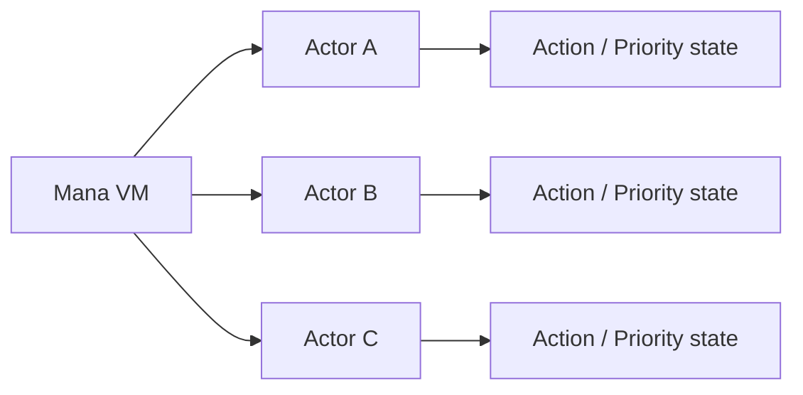
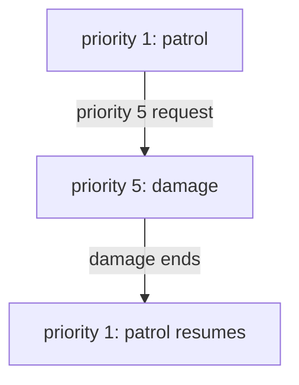

# Mana の実行モデル

Mana の実行モデルは、**複数の Actor がそれぞれ独立した実行状態を持ち、Mana VM がそれらを協調的に進める**ことを基本にしています。

OS のスレッドを Actor ごとに作る方式ではありません。

ゲームから見ると複数の Actor が同時に動いているように扱えますが、VM は Actor を順に実行していきます。

## 全体像



各 Actor は、自分の Action、Priority、実行位置、スタックなどの状態を保持します。

VM はそれぞれの Actor を進めることで、複数の処理を協調させます。

## VM が Actor を順に進める

Mana VM の `Run()` は、登録されている Actor を順に実行します。

概念的には次のように考えられます。

```text
VM Tick
 ├─ Actor A を進める
 ├─ Actor B を進める
 ├─ Actor C を進める
 └─ 必要なら新しくRequestされたActorをさらに進める
```

これは Actor ごとのCPUスレッドを意味しません。

そのため、Mana の並行性は **協調的な疑似並列実行** です。

ゲームエンジン側から見れば一つの VM を一定間隔で進めればよく、Mana 側では複数 Actor の状態を独立して記述できます。

## Actor は実行位置を持つ

Action が途中まで実行された状態で高い Priority の Action に割り込まれると、Mana は元の Action の実行位置を保持します。

```text
priority 1 : patrol
    line A
    line B   ← ここまで実行

priority 5 : damage が割り込む
```

割り込み時には、元の Action の実行位置やスタック状態が保存されます。

その後 `damage` が終了すると、保存されていた状態へ戻ります。

```text
priority 5 : damage
    終了
       ↓
priority 1 : patrol
    line C   ← 続きから再開
```

この仕組みが、Mana の Priority による割り込みの中心です。

## Priority ごとに実行状態を保持する

Actor は一つの「現在のAction」だけを持つのではなく、Priority ごとの実行状態を保持できます。

例えば、

```text
priority 5 : damage   ← 現在実行中
priority 3 : talk     ← 保留
priority 1 : patrol   ← 中断
```

という状態を持てます。

高い Priority の Action が終了すると、残っている中で実行可能な Priority へ戻ります。

このため、複雑なゲーム行動を一つの巨大な状態機械だけで表現せずに、Action と Priority の組み合わせへ分けられます。

## Action の終了と再開

Action が最後まで到達するか `return` すると、その Action の Priority は解放されます。

その下に中断中の Action があれば、保存されていた実行位置へ復帰します。



一方、復帰できる Action が残っていなければ、その Actor は実行するものがない状態になります。

## `request` は実行状態を追加する

`request` は単なるジャンプ命令ではありません。

```mana
request(5, Enemy->damage);
```

これは対象 Actor に新しい Priority の Action 実行状態を追加する操作です。

現在より高い Priority ならすぐに割り込み、低い Priority なら後で実行するために保持されます。同じ Priority の実行状態がすでに存在する場合、新しい Request は受理されません。

この点が通常の Function 呼び出しとの大きな違いです。

## 待機する側も Actor である

`awaitStart`、`awaitCompletion`、`join` では、呼び出し側 Actor が条件を満たすまで同じ命令を再評価する形で待機します。

つまり「VM 全体を止めて待つ」のではありません。

```text
EventController : Guard の終了待ち
Guard           : move を実行中
Guide           : 別のActionを進行可能
```

ある Actor が待っていても、他の Actor は進められます。

この性質が、イベント進行や複数キャラクターの同期に向いています。

## `yield` の役割

`yield()` は現在の Action の実行をその時点で一度譲ります。

長い処理を一度に進め切らず、次の VM の進行へ処理を渡したい場合に使います。

```mana
action update
{
    // 何らかの処理
    yield();

    // 次の進行で続きを行う
}
```

細かなスケジューリング規則は Language Reference で扱いますが、Concepts では「Actor が自分から実行権を譲る仕組み」と考えてください。

## `rollback` は Priority を巻き戻す

通常は現在の Action が終了すると一段ずつ元の Action へ戻ります。

`rollback` を使うと、指定した Priority より上の実行状態をまとめて破棄し、より低い Priority の状態へ戻せます。

これは例えば、

- 行動をキャンセルする
- 一連の割り込み状態をまとめて終了する
- 強制的に基本行動へ戻す

といった制御に使えます。

正確な境界条件や構文は Language Reference で扱います。

## `refuse` と `lock`

`refuse()` は、Actor が新しい Request を受け付けるかどうかを制御します。`comply()` で受付を再開できます。

`lock` は少し性質が異なります。現行コンパイラは `lock` ブロックの前後で同期実行状態を切り替える命令を生成し、VM は現在の Priority の `Synchronized` フラグを ON / OFF します。

ただし、**現行の `Actor::Request` はこのフラグを Request の受付判定や Priority の割り込み判定には直接使用していません。**

そのため、現在の `lock` を mutex や「絶対に割り込まれない atomic 区間」と同じものとして理解しないでください。正確な現行挙動は [実行制御リファレンス](../reference/reference-execution-control.md) で扱います。

## 起動時の `init` と `main`

プログラムをロードすると、VM は通常の Actor を生成し、初期化用の処理を行った後、各 Actor の `init` と `main` を Request します。

概念的には次の流れです。

```text
Program Image をロード
    ↓
Actor を生成
    ↓
グローバル初期化
    ↓
各 Actor の init
    ↓
各 Actor の main
    ↓
通常の VM 実行
```

これにより、Actor は起動時の初期化と通常動作を Action として記述できます。

## Mana の実行モデルを一言で表すと

Mana の特徴は、単に「複数の Actor がある」ことではありません。

重要なのは、

```text
Actor
  ├─ 自分の状態を持つ
  ├─ Action を持つ
  ├─ Request を受ける
  ├─ Priority ごとの実行状態を持つ
  └─ 割り込み・待機・再開を行う
```

という構造を、VM が協調的に進めることです。

このモデルによって、ゲームの「歩く」「話す」「攻撃する」「ダメージを受ける」「イベントを待つ」といった処理を、互いに独立した Action として組み合わせられます。

## ここまでで覚えておきたいこと

- Mana VM は複数 Actor を順番に進める
- Actor ごとに独立した実行状態を持つ
- Mana の並行性はOSスレッドによる並列実行ではない
- Priority ごとに Action の状態を保持できる
- 高Priorityの Action は低Priorityの Action に割り込める
- 同じPriorityの新しいRequestは、そのPriorityが既に存在すると受理されない
- Action 終了後は中断していた Action を再開できる
- await 系の待機は VM 全体を止めない
- `refuse` は新しいRequestの受付を制御する
- `lock` は現行実装では同期状態フラグを切り替えるが、Requestの割り込み判定を直接抑止するものではない

## 次に読む

ここまでで、Mana の中心となる Actor / Action / Request / Priority / VM 実行モデルの全体像を説明しました。

次は Module、Phantom、Namespace といった、より大きなスクリプト構成を支える概念を扱います。
