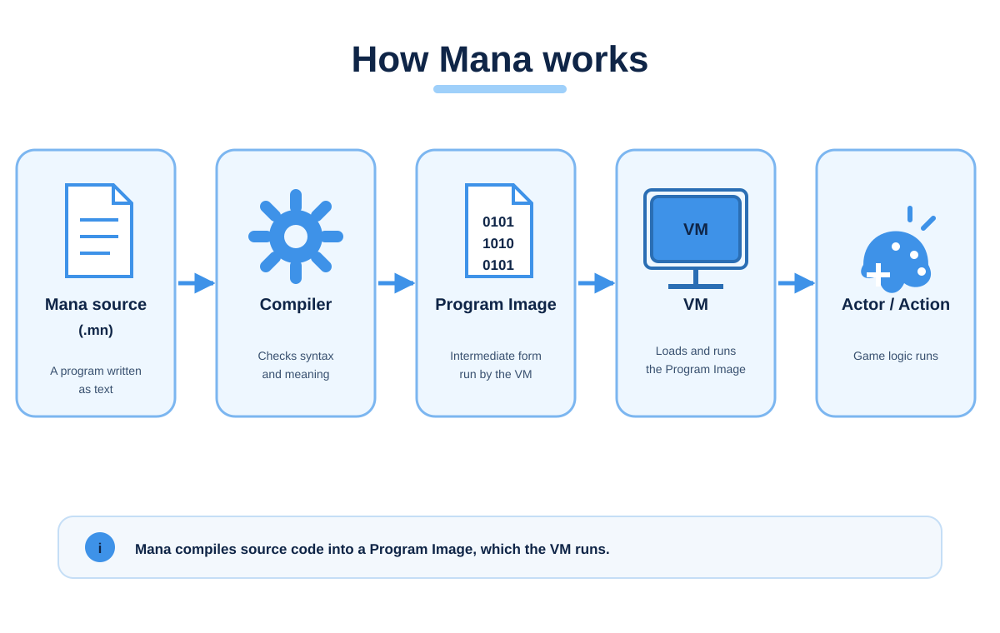
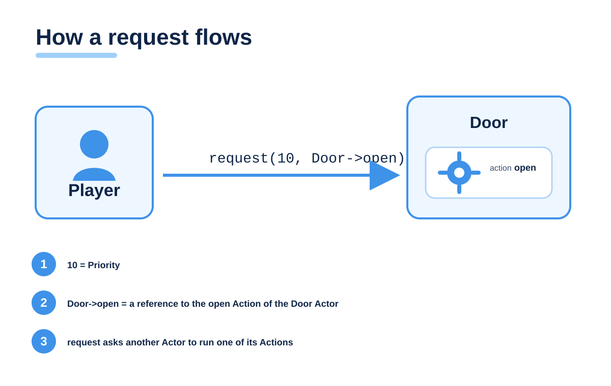
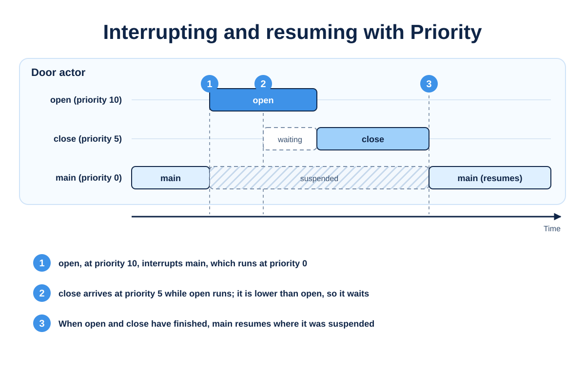

## What is Mana?

Mana is a programming language for describing, in plain text, how characters and events unfold in a game.

It lets you write something like "the guide speaks → the gate opens → the guide gives the next hint" as separate roles that work together. A unit of processing is an **Actor**, what it does is an **Action**, and asking another Actor to do something is a **Request**.



The Compiler turns Mana source code into a Program Image, and the VM runs it. Drawing, sound and input stay in the game itself; Mana describes the order and the conditions in which they happen.

## Why Mana exists

In a game, conversations, doors, enemies and effects all seem to happen at once. Put them into one long routine and every part starts to depend on the others, and keeping track of state gets hard.

Mana sorts this out in the language itself.

- Each role is its own Actor, with its own state and Actions
- Actors ask each other for work through Requests, and never reach into each other's internals
- Priority says which Action matters most right now
- Waiting is explicit, with `awaitStart` and `awaitCompletion`

Because the flow of an event is written in the language's own terms, the game's C++ code doesn't have to manage it.

## Actor / Action / Request

An **Actor** is a unit of execution with its own state and behaviour. It can be a character, but also a door or the controller that runs an event.

An **Action** is something an Actor does. `main` and `init` are special Actions that run when the Actor starts.

A **Request** asks another Actor to run one of its Actions. The Actor that asked carries straight on.



Besides simply asking, you can wait until the other Actor starts with `awaitStart`, or until it finishes with `awaitCompletion`.

## Priority

Every Request carries a Priority. The larger the number, the higher the priority.

Priority decides **which Action runs first within the same Actor**. A higher-priority Action interrupts the one that is running, and when it finishes, the interrupted Action resumes.



That means you can interrupt a conversation with a warning and then return to the conversation, written exactly that way.

## A small Mana program

The event controller waits for the guide to finish talking, then opens the gate.

```mana
actor Event
{
    action main
    {
        awaitCompletion(10, Guide->talk);
        awaitCompletion(10, Gate->open);
        print("Event: Finished.\n");
    }
}

actor Guide
{
    action talk
    {
        print("Guide: Welcome!\n");
    }
}

actor Gate
{
    action open
    {
        print("Gate: Open.\n");
    }
}
```

When you run it, the conversation, the gate and the end of the event are printed in that order.

```text
Guide: Welcome!
Gate: Open.
Event: Finished.
```

Mana also has variables, conditions, loops, functions and namespaces. The [Tutorial](wiki:Tutorial) introduces them one at a time.

## Compiler and VM

Mana is split into a Compiler and a VM.

- The **Compiler** reads `.mn` source code, checks its syntax and meaning, and outputs a **Program Image**.
- The **VM** loads the Program Image and runs its Actors and Actions.

The Compiler can be embedded as a C++ library. During development you can compile scripts inside the game, and in the shipped product load only the Program Images you prepared in advance. Game functions are called from Mana as Native Functions.

[C++ Integration](wiki:Integration) explains how to embed Mana.

## What it is good for

- NPC conversations, and events that change depending on conditions
- Objects with state, such as doors, traps and switches
- The order of cutscenes and effects
- Choosing enemy AI behaviour, and resuming after an interruption
- Event logic you want to adjust without rebuilding the game

Heavy work such as rendering, physics and sound stays in the game. Mana decides when and in what order it is called.

## Documentation

Everything for learning and reference is in the Wiki, in English and Japanese. The Japanese manual is the reference version, and the English manual is its translation.

- [Getting Started](wiki:Getting-Started) — set up Mana and run it for the first time
- [Tutorial](wiki:Tutorial) — build an event with Actors and Actions
- [Concepts](wiki:Concepts) — the execution model and the ideas behind the design
- [Language Reference](wiki:Language-Reference) — the exact syntax and language features
- [C++ Integration](wiki:Integration) — embed the Compiler and VM in your application

## GitHub

Source code, releases and issue reports are on GitHub.

- [Repository](https://github.com/shun126/Mana)
- [Releases](https://github.com/shun126/Mana/releases)
- [Issues](https://github.com/shun126/Mana/issues)
- [License](https://github.com/shun126/Mana/blob/master/LICENSE.md)
