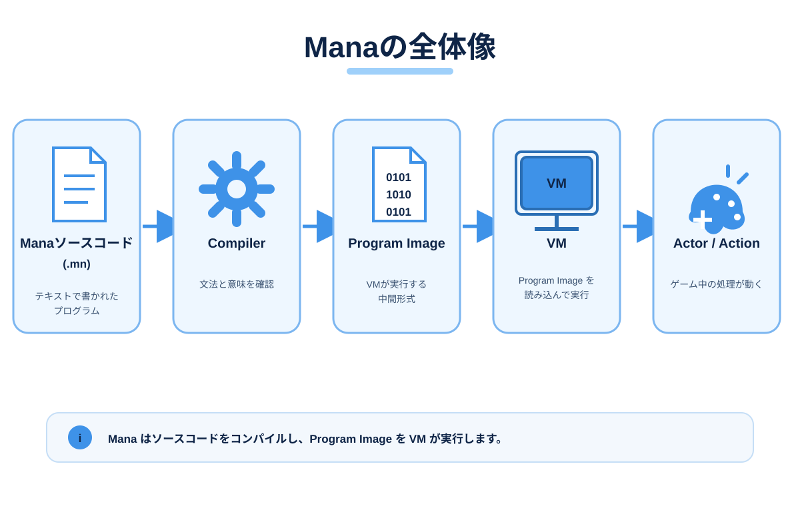
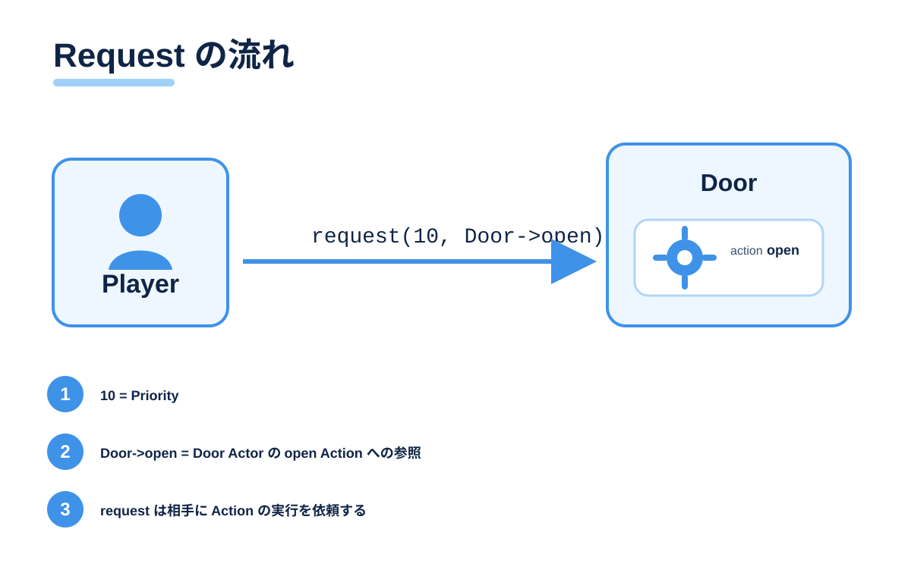
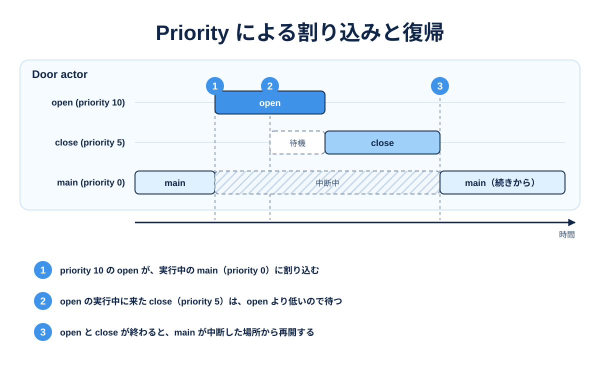

## Mana とは

Mana は、ゲーム内のキャラクターやイベントの進行を、テキストで記述するプログラミング言語です。

「案内役が話す → 門が開く → 次の案内をする」のように、複数の役割が関わる処理を、役割ごとに分けて書けます。処理のまとまりを **Actor**、その行動を **Action**、他の Actor への依頼を **Request** と呼びます。



Mana のソースコードは Compiler が Program Image へ変換し、VM が実行します。描画・音声・入力といった機能はゲーム本体が持ち、Mana はそれらを動かす順番と条件を記述します。

## なぜ Mana を作ったのか

ゲームでは、会話、扉の開閉、敵の行動、演出が同時進行しているように見えます。これらを一つの長い処理へ集めると、ある処理の都合が別の処理へ影響しやすくなり、状態管理も複雑になります。

Mana は、この問題を言語の側から整理します。

- 役割ごとに Actor を分け、それぞれが自分の状態と Action を持つ
- Actor 同士は Request で依頼し合い、直接相手の内部を触らない
- 「今どの行動を優先するか」を Priority で表す
- 待ち合わせを `awaitStart` と `awaitCompletion` で明示する

イベントの進行そのものを言語の語彙で書けるため、ゲーム本体の C++ コードに進行管理を持ち込まずに済みます。

## Actor / Action / Request

**Actor** は、自分の状態と処理を持つ実行単位です。キャラクターに限らず、扉やイベント進行役にも使います。

**Action** は、Actor の行動です。`main` と `init` は特別な Action で、Actor の開始時に実行されます。

**Request** は、他の Actor へ Action の実行を依頼する命令です。依頼した側はすぐ次へ進みます。



依頼するだけでなく、相手が始めるまで待つ `awaitStart`、相手が終えるまで待つ `awaitCompletion` も使えます。

## Priority

Request には Priority（優先度）を指定します。数が大きいほど優先されます。

Priority は、**同じ Actor の中でどの Action を優先するか**を表します。高い Priority の Action は実行中の Action へ割り込み、終わると元の Action へ戻ります。



会話の途中で警告を割り込ませ、その後で会話へ戻る、といった進行をそのまま書けます。

## 小さな Mana コード

進行役が案内役の会話を待ち、門を開けるイベントです。

```mana
actor Event
{
    action main
    {
        awaitCompletion(10, Guide->talk);
        awaitCompletion(10, Gate->open);
        print("Event: Finished.\n");
    }
}

actor Guide
{
    action talk
    {
        print("Guide: Welcome!\n");
    }
}

actor Gate
{
    action open
    {
        print("Gate: Open.\n");
    }
}
```

実行すると、会話、門、完了の順に出力されます。

```text
Guide: Welcome!
Gate: Open.
Event: Finished.
```

変数、条件分岐、繰り返し、関数、namespace も使えます。書き方は [Tutorial](wiki:Tutorial) で順番に学べます。

## Compiler と VM

Mana は Compiler と VM に分かれています。

- **Compiler** が `.mn` のソースコードを読み、文法と意味を確認して **Program Image** を出力します。
- **VM** が Program Image を読み込み、Actor と Action を実行します。

Compiler は C++ のライブラリとして組み込めるため、開発中はゲーム内でスクリプトをコンパイルし、製品では事前に用意した Program Image だけを読み込む、といった使い分けができます。ゲーム側の関数は Native Function として Mana から呼び出します。

組み込み方法は [C++ Integration](wiki:Integration) にまとめてあります。

## 向いている用途

- NPC の会話や、条件によって変わるイベント進行
- 扉、仕掛け、スイッチなど、状態を持つオブジェクトの制御
- カットシーンや演出の順序制御
- 敵 AI の行動選択と、割り込みからの復帰
- ゲーム本体を再ビルドせずに調整したい進行まわりの処理

描画、物理、サウンドなどの重い処理はゲーム本体が担当し、Mana はそれらを呼び出す順番と条件を受け持ちます。

## Documentation

学習と参照はすべて Wiki にあります。

- [Getting Started](wiki:Getting-Started) — Mana を用意し、初めて動かす
- [Tutorial](wiki:Tutorial) — Actor と Action を使ってイベントを作る
- [Concepts](wiki:Concepts) — 実行モデルと設計の考え方
- [Language Reference](wiki:Language-Reference) — 構文と言語機能を正確に調べる
- [C++ Integration](wiki:Integration) — Compiler と VM をアプリケーションへ組み込む

## GitHub

ソースコード、リリース、課題の報告は GitHub にあります。

- [リポジトリ](https://github.com/shun126/Mana)
- [リリース](https://github.com/shun126/Mana/releases)
- [Issues](https://github.com/shun126/Mana/issues)
- [ライセンス](https://github.com/shun126/Mana/blob/master/LICENSE.md)
