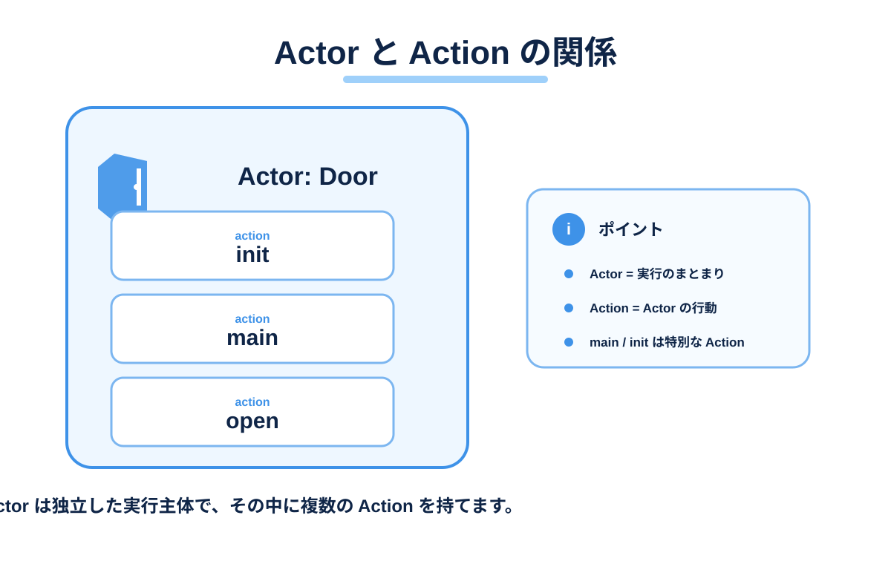

# Actor と Action

このページでは、Mana の中心となる `actor` と `action` を学びます。

## このページで分かること

- Actor は Mana の基本的な実行単位である
- Action は Actor が行う処理を表す
- 1つの Actor は複数の Action を持てる
- `main` は特別な Action である
- Action を定義しただけでは、すべての Action が自動的に実行されるわけではない



## Actor は「実行する主体」

Mana では、処理を Actor という単位に分けて記述します。

```mana
actor Greeter
{
    action main
    {
        print("Hello from Greeter!\n");
    }
}
```

この例では、`Greeter` という Actor を定義しています。

Actor はゲーム内のキャラクターに対応させることもできますが、キャラクターだけに限定されません。

例えば次のような役割を Actor にできます。

- NPC
- 敵キャラクター
- ドアや仕掛け
- シーン進行の管理役
- バトル進行の管理役
- UI や演出を制御する役

つまり Actor は、**自分の役割に応じて処理を実行する主体**だと考えると分かりやすいでしょう。

## Action は Actor の行動

Actor の中には `action` を定義します。

```mana
actor Greeter
{
    action main
    {
        print("Hello!\n");
    }

    action greet
    {
        print("Nice to meet you!\n");
    }
}
```

この `Greeter` Actor は、`main` と `greet` という2つの Action を持っています。

Action は、その Actor が行える一つの処理や行動を表します。

ゲームで考えるなら、例えば次のように分けられます。

```text
Enemy
 ├─ think
 ├─ move
 ├─ attack
 └─ dead
```

1つの Action に何でも詰め込むより、**1 Action = 1つの目的**くらいを目安に分けると、処理の意図を追いやすくなります。

## `main` は特別な Action

`main` は通常の Action 名とは少し扱いが異なります。

Mana VM はプログラムを開始すると、各 Actor の `main` Action を開始するための Request を行います。

そのため、次のコードはプログラム開始後に実行されます。

```mana
actor Hello
{
    action main
    {
        print("Hello, Mana!\n");
    }
}
```

一方、次の `greet` Action は定義しただけでは実行されません。

```mana
actor Hello
{
    action main
    {
        print("main\n");
    }

    action greet
    {
        print("greet\n");
    }
}
```

このプログラムを実行すると、`main` は開始されますが、`greet` はまだ実行されません。

```text
main
```

では、`greet` を実行したい場合はどうすればよいのでしょうか。

Mana では別の Action を開始してほしいとき、**Request** を送ります。

## 複数の Actor を定義できる

1つのソースファイルには複数の Actor を記述できます。

```mana
actor Mother
{
    action main
    {
        print("Mother started.\n");
    }
}

actor Child
{
    action main
    {
        print("Child started.\n");
    }
}
```

Mana VM は Actor ごとに Action の実行状態を管理します。

この仕組みによって、複数の Actor がそれぞれ自分の処理を持ちながら、一つのイベントやシーンを構成できます。

ただし、この時点では Actor 同士はまだ連携していません。

次のページで、一方の Actor から別の Actor の Action を開始する方法を学びます。

## ここまでで覚えておきたいこと

- `actor` は Mana の基本的な実行主体
- Actor は必ずしもゲームキャラクターだけを意味しない
- `action` は Actor が行う処理を定義する
- 1つの Actor は複数の Action を持てる
- `main` はプログラム開始時に VM から開始される特別な Action
- 通常の Action は定義しただけでは実行されない

## 次に読む

次は [Action を Request する](./tutorial-request.md) で、Actor 同士を連携させます。
