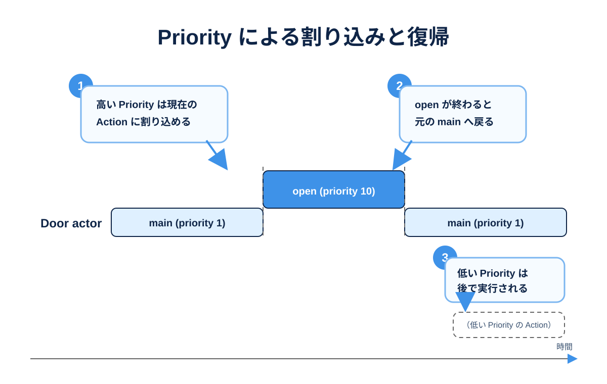

# Priority で Action の実行順を制御する

前のページまでで、Actor に Action を Request できるようになりました。

```mana
request(kTalkPriority, NPC->talk);
```

`request` の第1引数は **Priority（優先度）** です。

このページでは、Priority が Actor の Action 実行にどのような影響を与えるのかを学びます。

## このページで分かること

- Priority は Action Request の優先度を表す
- 数値が大きいほど Priority が高い
- 高い Priority の Request は、低い Priority の Action に割り込める
- 低い Priority の Request は、実行できる状態になるまで保持される
- 同じ Priority がすでに使用中または予約済みなら、その Request は受理されない
- `priority` で現在実行している Action の Priority を参照できる



## Priority は「どの Action を優先するか」の値

例えば NPC に、次の3種類の Action があるとします。

```mana
const int kIdlePriority = 1;
const int kTalkPriority = 10;
const int kEmergencyPriority = 100;

actor NPC
{
    action idle
    {
        print("idle\n");
    }

    action talk
    {
        print("talk\n");
    }

    action emergency
    {
        print("emergency\n");
    }
}
```

ここでは、Priority を次のように決めています。

```text
100  emergency  高い
 10  talk
  1  idle       低い
```

Mana では、**数値が大きいほど高い Priority** です。

Priority は「何秒後に実行するか」や「何フレーム待つか」を表す値ではありません。

## 高い Priority は現在の Action に割り込める

NPC が Priority 10 の `talk` を実行している途中に、Priority 100 の `emergency` が Request されたとします。

```mana
request(kEmergencyPriority, NPC->emergency);
```

Priority 100 は Priority 10 より高いため、`emergency` が優先されます。

イメージすると次のようになります。

```text
NPC

Priority 10 : talk
                 |
                 | Priority 100 の Request
                 v
Priority 100: emergency
                 |
                 | 終了
                 v
Priority 10 : talk の続き
```

高い Priority の Action が終了すると、実行可能な低い Priority の Action へ戻ります。

この仕組みによって、例えば「通常行動中でも緊急イベントを優先する」といった処理を記述できます。

## 低い Priority の Request は後で実行される

逆に、NPC が Priority 100 の `emergency` を実行している途中で、Priority 10 の `talk` が Request された場合を考えます。

```mana
request(kTalkPriority, NPC->talk);
```

Priority 10 は現在の Priority 100 より低いため、すぐには `talk` へ切り替わりません。

```text
Priority 100: emergency
                 |
                 | Priority 10 の Request
                 |  （待機）
                 |
                 | emergency 終了
                 v
Priority 10 : talk
```

つまり Priority は、Actor が複数の Request を受けたときに、どの Action を優先して実行するかを決める仕組みです。

## 同じ Priority は同時に使えない

一つの Actor では、同じ Priority の Request を複数保持しません。

例えば Priority 10 の Request がすでに実行中または予約済みのときに、別の Priority 10 の Request を送ると、後から送った Request は受理されません。

```mana
request(10, NPC->talk);
request(10, NPC->wave);
```

この2つを「必ず順番に実行される2件の仕事」と考えてはいけません。

異なる意味を持つ Action を同時に保持したい場合は、Priority の設計を考える必要があります。

## Priority には名前を付ける

Priority を数値で直接書くこともできます。

```mana
request(100, NPC->emergency);
```

しかし、規模が大きくなると `100` の意味が分かりにくくなります。

そのため、定数として名前を付けることを推奨します。

```mana
const int kIdlePriority = 1;
const int kTalkPriority = 10;
const int kEmergencyPriority = 100;

request(kEmergencyPriority, NPC->emergency);
```

Priority は単なる数字ではなく、ゲーム中の行動ルールを表す値として設計すると読みやすくなります。

例えば、

```text
1    通常行動
10   会話
50   イベント
100  緊急処理
```

のようにプロジェクト内で基準を決めておく方法があります。

これは一例であり、Mana が特定の数値を予約しているという意味ではありません。

## 現在の Priority を調べる

Action の中では、`priority` という特別な値を使って、現在実行中の Priority を参照できます。

```mana
actor NPC
{
    action talk
    {
        print("priority: %d\n", priority);
    }
}
```

例えば Priority 10 でこの Action が Request されていれば、`priority` はその Priority を表します。

```mana
request(10, NPC->talk);
```

`priority` は、現在の Action がどの Priority で動いているかによって処理を変えたい場合などに利用できます。

## Priority はスレッドの優先度ではない

Priority という名前から、OS のスレッド優先度や CPU の実行時間を想像するかもしれません。

Mana の Priority はそれとは異なります。

Priority は、**一つの Actor が複数の Action Request を持ったときの実行関係**を表すための値です。

```text
Actor
 ├─ Priority 100 : emergency
 ├─ Priority  10 : talk
 └─ Priority   1 : idle
```

Mana VM は Actor ごとにこの状態を管理します。

## Priority を細かくしすぎない

Priority を使えば複雑な割り込み関係を作れますが、すべての Action に別々の数値を割り当てる必要はありません。

最初は、ゲーム上の意味が明確な段階だけを用意することをおすすめします。

```mana
const int kNormalPriority = 10;
const int kEventPriority = 50;
const int kEmergencyPriority = 100;
```

必要になったときに段階を増やす方が、Priority の関係を理解しやすくなります。

## ここまでで覚えておきたいこと

- `request` の第1引数は Priority
- Priority は大きい数値ほど高い
- 高い Priority は低い Priority の Action より優先される
- 低い Priority の Request は実行可能になるまで保持される
- 同じ Priority の Request は一つの Actor に重複して保持されない
- Priority は意味の分かる定数名にする
- `priority` で現在実行中の Priority を参照できる

## 次に読む

Priority が分かると、「Request した Action が始まるまで待つ」「終わるまで待つ」という制御も理解しやすくなります。

次は [Action の開始や終了を待つ](./tutorial-wait-and-synchronization.md) で、`awaitStart`、`awaitCompletion`、`join`、`yield` を学びます。
