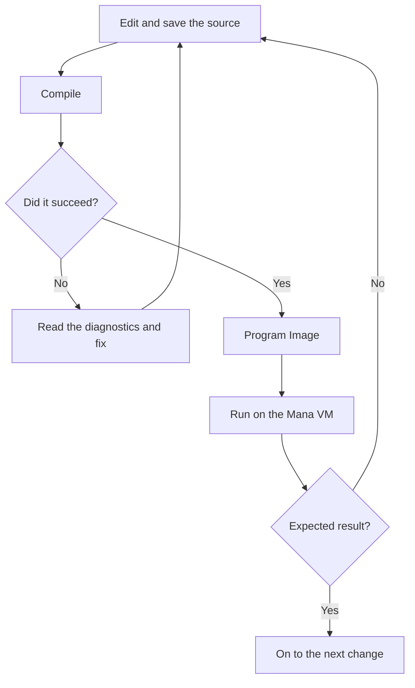

# Compiling, running and fixing errors

`mana hello.mn` compiles the source and runs the result on the Mana VM. This page looks at the two steps separately and has you fix an error.

## What compiling produces

The compiler checks grammar, names, types and so on, and produces the data to run: a **Program Image**. A Program Image is data the Mana VM reads; it is not an executable the CPU runs directly.



A program that compiles does not necessarily do what you intended. For example, a program that prints things in the wrong order still runs if its grammar is correct.

## Make one mistake on purpose, then fix it

Replace `hello.mn` with the following. This example is **code that fails to compile on purpose**.

```mana
actor Hello
{
    action main
    {
        print("Hello, Mana!\n")
    }
}
```

Save and run it.

```text
mana hello.mn
```

The `print` line has no `;` at the end, so compilation fails. These are the diagnostics the current implementation reports. The file name may be preceded by the path where it is saved.

```text
hello.mn(6): error: syntax error
hello.mn(8): error: syntax error
```

The first line means "a grammar problem was found on line 6 of hello.mn". The wording of diagnostics differs between versions, but look for the following information.

| Information in a diagnostic | What to check |
| --- | --- |
| File name | Which file to fix |
| Line number | Where the problem was found |
| Message | Whether it is a grammar problem, a naming problem and so on |

The compiler may only notice a mistake on the line after the one where something was left out. Here, even if it points at the line with the closing brace, check the `print` just before it.

Put the `;` back at the end, save, and run it again. Fixing the first error can also make the errors after it disappear. Don't try to fix everything at once; start from the first diagnostic.

## Work out which step is the problem

| Symptom | What to do first |
| --- | --- |
| `mana` cannot be found | Check the short name set up on the [setup page](./getting-started-installation.md) |
| `hello.mn` cannot be found | Check where it is saved, the working folder and the extension |
| Compilation fails | Check the file and line in the diagnostic, and the line just before it |
| An error occurs while running | Read the runtime message. Some problems are not prevented just because compilation succeeded |
| No error, but the result is wrong | Check that you saved, then add `print` calls partway through to see which parts ran |
| The program does not finish | Press Ctrl+C in the terminal to stop it, and check things like the exit condition of a loop |

When you ask for help, include the command you ran, the code, the full diagnostics and the result you expected. That makes the situation easy to understand.

## Save the compiled result

For everyday learning, `mana hello.mn` is enough. If you want to compile and run separately, use the following.

**Command that compiles and saves:**

```text
mana hello.mn -o hello.mx
```

`-o` is the option that sets the output file. Here it creates `hello.mx` and does not run it.

**Command that runs the saved result:**

```text
mana --execute hello.mx
```

Changing the source does not change a `hello.mx` you made earlier. Compile again to include your changes. All options are listed in the [CLI reference](../reference/reference-cli.md).

Next, [Actor and Action](../tutorial/tutorial-actor-and-action.md) splits the work into roles.
