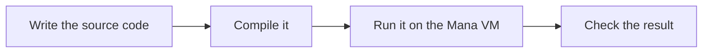

# What is Mana?

Mana is a programming language for describing, in text, how characters and events unfold in a game. You use it to combine work done by several roles, such as "the guide speaks → the gate opens → the guide gives the next hint".


## What you build in this guide

First you print some text, then you build a small event in which a guide and a gate work together. The practice event prints text to the terminal. You do not need a game screen or character images.

```text
Guide: Welcome!
Gate: Open.
Event: Finished.
```

In a real game, the parts that print text are connected to the game's own conversations, animations and so on. Graphics, physics and sound are provided by the game, and Mana describes the order and the conditions in which they happen.

## Roles, behaviour and requests

In this example, the guide and the gate each become an **Actor**. An Actor is a unit of execution with its own processing and state. Besides characters, it can be a gate or the controller that runs a whole event.

The work an Actor does is an **Action**, and the way to ask for an Action to run is a **Request**.

| Term | Example in this event |
| --- | --- |
| Actor | The guide `Guide` and the gate `Gate` |
| Action | `talk` to talk, `open` to open |
| Request | The event controller asks the guide to talk |

You do not need to memorise these names now. You will check them as you write code.

## Write text, compile it, run it

A Mana program is written in a text editor and saved to a file. The program a person writes is **source code**, and the file it is saved in is a **source file**.

Mana has a compilation step. **Compiling** means checking the source code and turning it into data that can be run. An execution environment called the **Mana VM** runs that data.



In this guide, one command compiles and then runs your program. You do not have to program the compiler or the VM yourself.

## Choose where to start

- If you have never programmed before, continue with [Writing a program as text](./getting-started-programming-basics.md).
- If you are used to editing files and working in a terminal, you can start from [Setting up Mana](./getting-started-installation.md).
- If you want to embed Mana in a C++ application, see the [integration guide](../integration/README.md).
