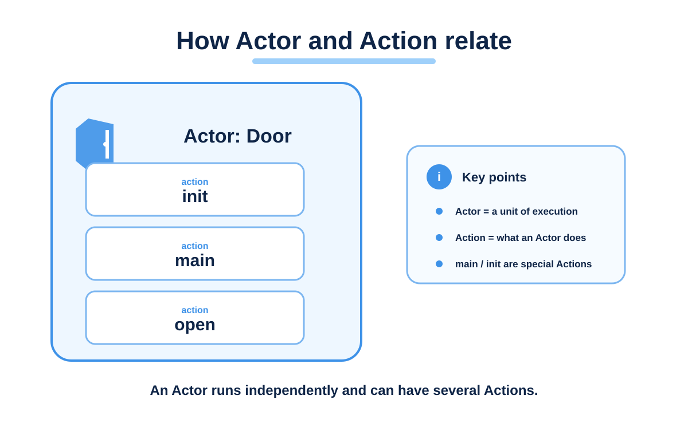
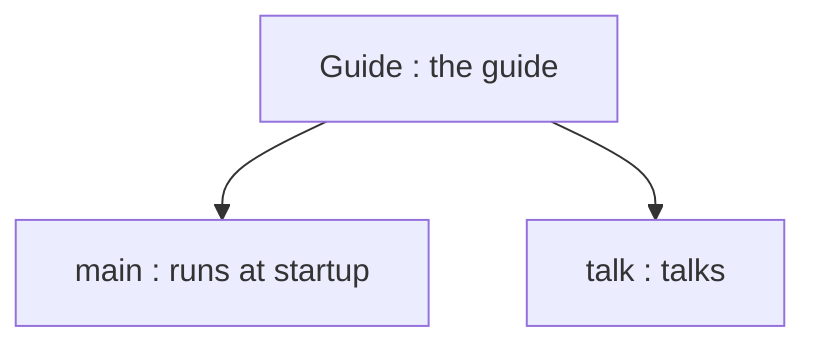

# Actor and Action

This page separates two ideas: defining a behaviour, and running it.



## Run it and see

This is the **whole file**. Save it in the Mana folder as `lesson.mn` and run `mana lesson.mn` from the terminal you set up on the setup page. Replace the previous chapter's code with the whole file rather than adding to it.

```mana
actor Guide
{
    action main
    {
        print("Guide: Ready.\n");
    }

    action talk
    {
        print("Guide: Welcome!\n");
    }
}
```

**Expected output:**

```text
Guide: Ready.
```

You can also run the [finished code that comes with Mana](../../../../examples/tutorial/02-actor.mn) from the Mana folder with this command.

```text
mana examples/tutorial/02-actor.mn
```


## Why doesn't Welcome! appear?

`Guide` is one Actor with two Actions, `main` and `talk`. The VM asks for `main` to run at startup, but `talk` does not run just because it is defined.



`actor` and `action` are words whose meaning Mana defines. `Guide` and `talk` are names the author chose. `main` has the special meaning of being used at startup.

One Actor can define several Actions. Split them by purpose: a gate might have `open` and `close`, and a guide `talk` and `warn`.

## Actors are not only for characters

In the next chapter, the controller that runs the whole event also becomes an Actor. A single source file can define several Actors, each with its own work.

If several Actors have a `main`, each of them runs at startup. There is no mechanism that picks a single `main` for the whole file. To decide the order between Actors, use the requests and waiting you learn from the next chapter on.

## Change one thing

Change the text in `main` to `Guide: Waiting.`, then save and run. Changing the text in `talk` does not show up in the output yet.

Next, you make that `talk` run.
## Read next

Continue with [Requesting an Action](./tutorial-request.md).
