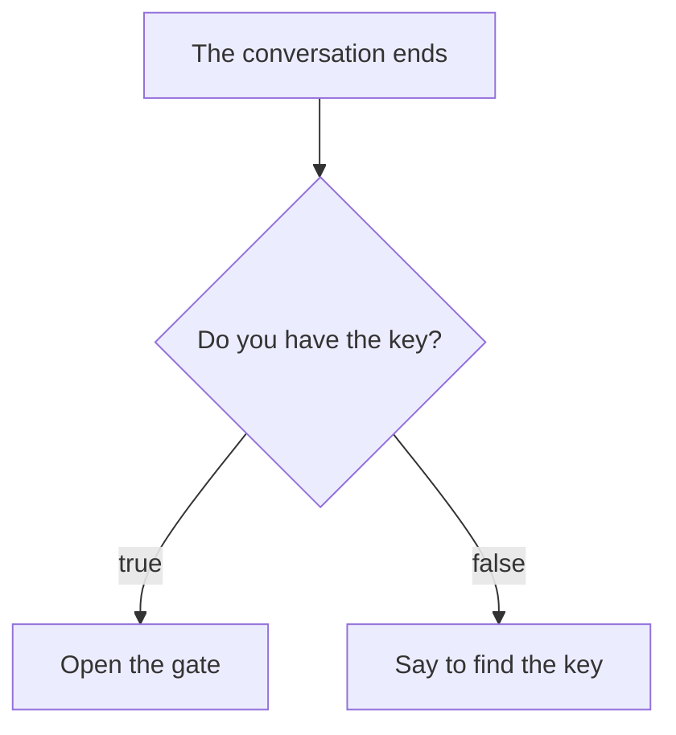

# Changing behaviour with conditions

You add a condition to the first event: open the gate only if you have the key.

## Run it and see

This is the **whole file**. Save it in the Mana folder as `lesson.mn` and run `mana lesson.mn` from the terminal you set up on the setup page. Replace the previous chapter's code with the whole file rather than adding to it.

```mana
actor Event
{
    action main
    {
        bool hasKey = true;

        awaitCompletion(10, Guide->talk);
        if (hasKey)
        {
            awaitCompletion(10, Gate->open);
        }
        else
        {
            print("Event: Find the key.\n");
        }
    }
}

actor Guide
{
    action talk
    {
        print("Guide: Welcome!\n");
    }
}

actor Gate
{
    action open
    {
        print("Gate: Open.\n");
    }
}
```

**Expected output:**

```text
Guide: Welcome!
Gate: Open.
```

You can also run the [finished code that comes with Mana](../../../../examples/tutorial/06-conditions.mn) from the Mana folder with this command.

```text
mana examples/tutorial/06-conditions.mn
```


## if and else

`bool hasKey = true;` represents having the key. `true` is the value for "holds" and `false` for "does not hold".

`if (hasKey)` runs the first block only when that value holds. If it does not, the `else` block runs instead. Both never run.



## Change one thing

Change the initial value of `hasKey` to `false`, then save and run.

```text
Guide: Welcome!
Event: Find the key.
```

Here you set whether you have the key yourself, in the code. Nothing is reading the player's actions or inventory automatically.

## Comparing numbers

With the conversation count from the previous chapter, writing `gTalkCount == 0` checks whether it is 0.

| Written as | Meaning |
| --- | --- |
| `a == b` | Equal |
| `a != b` | Not equal |
| `a < b` / `a <= b` | Less than / less than or equal |
| `a > b` / `a >= b` | Greater than / greater than or equal |

`=` assigns and `==` compares. Writing `hasKey = true` changes the value, so keep it apart from checking a condition.

## Combining conditions

**Example inside an Action:**

```mana
bool hasKey = true;
bool isOpen = false;
if (hasKey && !isOpen)
{
    print("Ready to open.\n");
}
```

`&&` holds when both hold, `||` when at least one holds, and `!` flips whether it holds. The condition above means "you have the key and it is not open yet".

## Practice: changing what is said

Go back to the finished code of the [previous chapter](./tutorial-variables.md) and replace the body of `talk` with the following.

```mana
if (gTalkCount == 0)
{
    print("Guide: Welcome!\n");
}
else
{
    print("Guide: Welcome back!\n");
}
gTalkCount = gTalkCount + 1;
```

The first time it says `Welcome!`, the second time `Welcome back!`. Notice that it compares first and increases the count afterwards.
## Read next

Continue with [Repeating work](./tutorial-loops.md).
