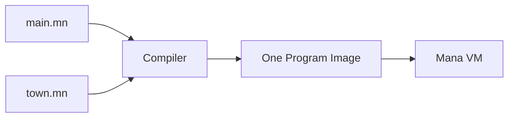

# Splitting a program into several files

You split [the first event you built](./tutorial-small-event.md) into two files without changing what it does. Before adding new features, you make it possible to edit the controller and the town's Actors separately.

## Create two files

Create a `lesson` folder in the Mana folder and save the following two files in it.

```text
lesson/
├─ main.mn
└─ town.mn
```

**Whole file town.mn:**

```mana
actor Guide
{
    action talk
    {
        print("Guide: Welcome!\n");
    }
}

actor Gate
{
    action open
    {
        print("Gate: Open.\n");
    }
}
```

**Whole file main.mn:**

```mana
import "town.mn";

actor Event
{
    action main
    {
        awaitCompletion(10, Guide->talk);
        awaitCompletion(10, Gate->open);
        print("Event: Finished.\n");
    }
}
```

## Run the entry file

Run it from the terminal in the Mana folder.

```text
mana lesson/main.mn
```

**Expected output:**

```text
Guide: Welcome!
Gate: Open.
Event: Finished.
```

You can also use the [main.mn](../../../../examples/tutorial/11-files/main.mn) and [town.mn](../../../../examples/tutorial/11-files/town.mn) that come with Mana.

```text
mana examples/tutorial/11-files/main.mn
```

## import reads another source in as well

`import "town.mn";` brings another source into what is compiled. With the default file loading, a relative path is resolved from **the folder of the file that contains the import**.

In this example it looks for `town.mn` in the same place as `main.mn`. Keep this apart from `lesson/main.mn` given in the terminal, which is resolved from the working folder.



Each file does not get its own VM. The Actors in `town.mn` become part of the same program.

## Change one thing

Change the guide's text in `town.mn`, save, and run `mana lesson/main.mn` again. The change in the imported file shows up without touching the entry file.

If you then rename `town.mn` to `village.mn`, you also need to change the `import` in `main.mn` to the same name.

## import and include

For ordinary splitting of source, start with `import`. It brings in a source that resolves to the same file only once, which prevents shared definitions from being read twice. `include` reads the file every time it is written.

The detailed rules are in the [source files reference](../reference/reference-source-files.md).

## Read next

Splitting into files does not group names automatically. In [Organising names with namespace](./tutorial-namespace.md), you learn how to avoid names clashing.
