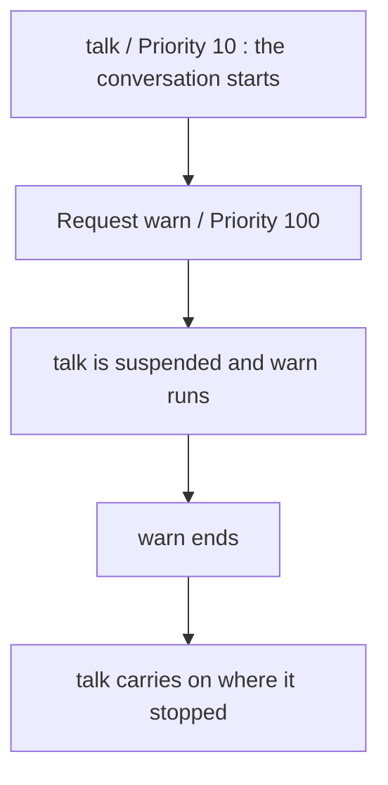

# Interrupting and resuming with Priority

A Priority says **which Action comes first within the same Actor**. The larger the number, the higher the priority. In this chapter the guide gives a warning in the middle of a conversation, then goes back to the rest of the conversation.


## Run it and see

This is the **whole file**. Replace `lesson.mn` in the Mana folder with it, save, and run it with `mana lesson.mn`.

```mana
const int kNormalPriority = 10;
const int kEmergencyPriority = 100;

actor Event
{
    action main
    {
        awaitCompletion(kNormalPriority, Guide->talk);
        print("Event: Finished.\n");
    }
}

actor Guide
{
    action talk
    {
        print("Guide: Talk begins.\n");
        request(kEmergencyPriority, self->warn);
        print("Guide: Talk resumes.\n");
    }

    action warn
    {
        print("Guide: Watch out!\n");
    }
}
```

**Expected output:**

```text
Guide: Talk begins.
Guide: Watch out!
Guide: Talk resumes.
Event: Finished.
```

You can also run the [finished code that comes with Mana](../../../../examples/tutorial/09-priority.mn) with `mana examples/tutorial/09-priority.mn`.


## Giving numbers a name

`const int kNormalPriority = 10;` declares a **constant**: a name for an integer that does not change. `const` says it does not change. Starting the name with `k` is a naming convention of these lessons.

Until now you wrote 10 directly. Now that there are several priorities, names tell apart 10 for normal work and 100 for emergencies.

## When the higher Priority ends, the earlier work carries on

`self` is the Actor that is running the current work. From `Guide`'s `talk`, it requests the same `Guide`'s `warn` at a higher Priority.



This uses `request`. Waiting on your own Actor with `awaitStart` or `awaitCompletion` causes a runtime error.

This example is for watching an interrupt within one Actor. It does not mean that a Request to another Actor runs at an arbitrary moment, like an operating-system interrupt. How Actors are advanced is explained in the [execution model](../concepts/concept-execution-model.md).

## Higher, lower, the same

| Request, compared with the target Actor's state | Basic handling |
| --- | --- |
| A higher Priority that is not in use | Runs ahead of the current Action |
| A lower Priority that is not in use | Kept until it can run |
| The same Priority as one in use or reserved | The new request is not accepted |

To be accepted, the target Action must also exist and the Actor must be accepting requests, among other things. For the full conditions, see the [Request reference](../reference/reference-request.md).

A 10 in use on one Actor and a 10 in use on another Actor are managed separately. There is no single numbered table that decides the order of execution for the whole program.

## Change one thing

Change `kEmergencyPriority` in the finished code from 100 to 10. `talk` is already using 10, so `warn` is not accepted and the warning disappears from the output.

```text
Guide: Talk begins.
Guide: Talk resumes.
Event: Finished.
```

Change it back to 100 once you have tried it. You do not need a different Priority for every Action. To complete work in order, reuse the same value, and use different levels only where one Action needs to interrupt another.

## Read next

In [Choosing between waiting and synchronisation](./tutorial-wait-and-synchronization.md), you look closely at the completion waits you have been using.
