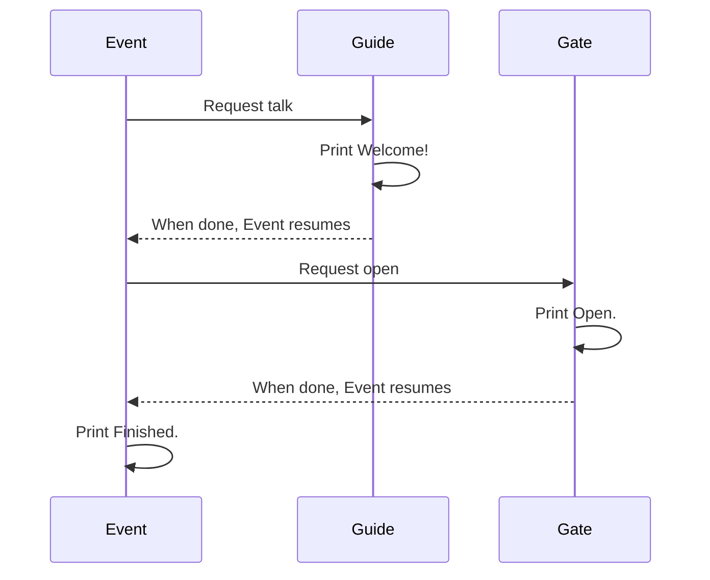

# Talk, then open the gate

Here you finish your first event. The guide talks, the gate opens once the talking is over, and finally the event reports that it has finished.

There are no characters or gates on screen yet. You follow the event through the order of the output.

## Run it and see

This is the **whole file**. Save it in the Mana folder as `lesson.mn` and run `mana lesson.mn` from the terminal you set up on the setup page. Replace the previous chapter's code with the whole file rather than adding to it.

```mana
actor Event
{
    action main
    {
        awaitCompletion(10, Guide->talk);
        awaitCompletion(10, Gate->open);
        print("Event: Finished.\n");
    }
}

actor Guide
{
    action talk
    {
        print("Guide: Welcome!\n");
    }
}

actor Gate
{
    action open
    {
        print("Gate: Open.\n");
    }
}
```

**Expected output:**

```text
Guide: Welcome!
Gate: Open.
Event: Finished.
```

You can also run the [finished code that comes with Mana](../../../../examples/tutorial/04-event.mn) from the Mana folder with this command.

```text
mana examples/tutorial/04-event.mn
```


## Making an order with awaitCompletion

`awaitCompletion(10, Guide->talk);` requests the conversation and waits for it to complete before moving on. As with `request`, you give a priority and an Action.

In this example nothing else sends requests to the same Actors and the Priority used is free, so the work completes in order.



It is `Event` that waits. The whole Mana VM does not stop, so `Guide` and `Gate`, which it is waiting for, can get on with their work.

| What you want | Instruction to start with |
| --- | --- |
| Ask, and carry on without waiting for the other side to finish | `request` |
| Carry on after the requested work has finished | `awaitCompletion` |

In fact, `awaitCompletion` waits on a condition about the target Actor's Priority. If the request is not accepted, it carries on without waiting. When you bring in several requesters or interrupts, also check the conditions in [Waiting and synchronisation](./tutorial-wait-and-synchronization.md).

## Change one thing

Swap the two `awaitCompletion` lines in `Event`. Save and run, and the gate opens first, then the guide talks.

Once you have put them back, add another request for the conversation after the gate. The output becomes "talk → gate → talk → finished". The second request is made after the first conversation has finished, so the same Priority can be used again.

An Actor cannot use `awaitCompletion` on itself. Putting the work in a different Action does not make it a different Actor, and it fails with an error at run time.

## Connecting to a game comes later

What `Gate->open` does is print text, so no real door is drawn or animated yet. When you connect this to a game, you link that part to processing on the C++ side. First, let's add counts and conditions to this event.
## Read next

Continue with [Remembering state with variables](./tutorial-variables.md).
