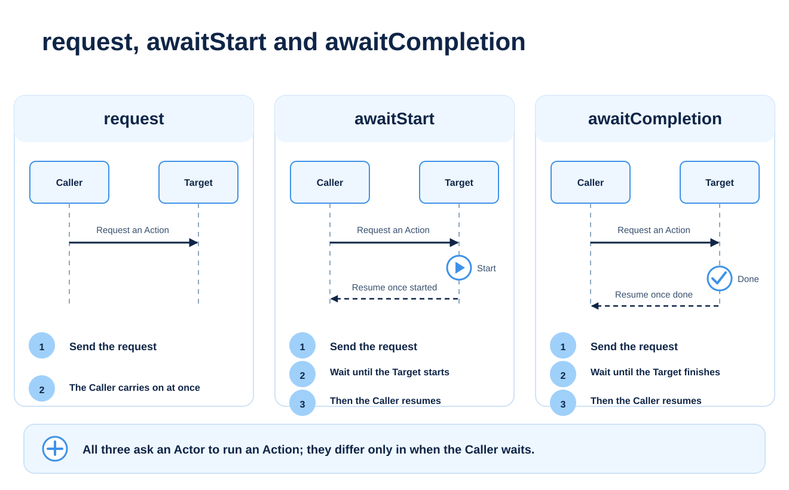

# Choosing between waiting and synchronisation

In [Talk, then open the gate](./tutorial-small-event.md), you made an order with `awaitCompletion`. This chapter adds more ways to wait: until the work can start, for an Actor that is already running, and handing over your own turn for a moment.



## First, a look back at waiting for completion

**Excerpt from the event's main:**

```mana
awaitCompletion(10, Guide->talk);
awaitCompletion(10, Gate->open);
```

Provided the requests are accepted and no other requester competes, this opens the gate after the conversation ends.

What `awaitCompletion` actually checks is **whether the target Actor's current Priority has fallen below the given value**. It does not record a completion notice for each request and wait for it.

## Three kinds of waiting

For the await instructions, the conditions below apply when the request is accepted.

| Instruction | Makes a new request? | When the caller can carry on |
| --- | --- | --- |
| `request(p, Actor->action)` | Yes | It does not wait |
| `awaitStart(p, Actor->action)` | Yes | The target Actor's current Priority is `p` or lower |
| `awaitCompletion(p, Actor->action)` | Yes | The target Actor's current Priority is lower than `p` |
| `join(p, Actor)` | No | The target Actor's current Priority is `p` or lower |

`p` is a placeholder name for this explanation. In real code you give an integer such as 10, or a constant.

`awaitStart` is for waiting until the target has reached a Priority at which the requested Action can start. **It does not guarantee that the first statement of that Action has already run.** If you need the result of the other work, keep "it can start" and "it has finished" apart.

`join(0, Guide);` does not start a new conversation. It waits until `Guide`'s current Priority is 0 or lower. `main` runs at Priority 0, so this condition does not mean that all of the Actor's work has finished either.

## When a request is not accepted

If the initial request is not accepted, `awaitStart` and `awaitCompletion` carry on without waiting. They do not keep requesting until the Priority is free.

For example, if Priority 10 is already in use on the target Actor, requesting a different Action at 10 does not guarantee that the Action runs. Don't treat returning from a wait on its own as proof that the behaviour succeeded.

The beginner's event avoids this conflict by having one controller make one request at a time, waiting for each to finish before asking for the next. In a design where several Actors send requests to the same Actor, also decide which requester uses which Priority.

Also, `awaitStart` / `awaitCompletion` targeting your own Actor causes a runtime error.

## Handing over your turn with yield

## Run it and see

This is the **whole file**. Replace `lesson.mn` in the Mana folder with it, save, and run it with `mana lesson.mn`.

```mana
actor Guide
{
    action main
    {
        print("Guide: Step 1.\n");
        yield();
        print("Guide: Step 2.\n");
    }
}
```

**Expected output:**

```text
Guide: Step 1.
Guide: Step 2.
```

You can also run the [finished code that comes with Mana](../../../../examples/tutorial/10-yield.mn) with `mana examples/tutorial/10-yield.mn`.


`yield()` hands execution back to the VM for a moment without ending the current Action. When it gets another chance to run, it carries on from where it left off.

The output alone does not show the gap. `yield()` is not an instruction to "wait one second", and it does not necessarily mean "wait one game frame" either. When the VM advances depends on how the host application calls it.

In a long loop, you can use `yield()` to give other Actors a chance to run. Waiting for real time or for an animation to finish is designed together with the game's updates and completion conditions.

## Check your choices

Think about which fits each purpose.

- Open the gate after the conversation ends: `awaitCompletion`
- Ask for a notification, and have the controller carry on without waiting for it: `request`
- Wait for the target's Priority to drop to a given value or lower, without asking for anything new: `join`
- Hand over your turn once without ending your own work: `yield`

Edge cases and related controls are covered in [Request](../reference/reference-request.md) and [Execution control](../reference/reference-execution-control.md).

## Read next

In [Splitting a program into several files](./tutorial-multiple-files.md), you organise the finished event.
