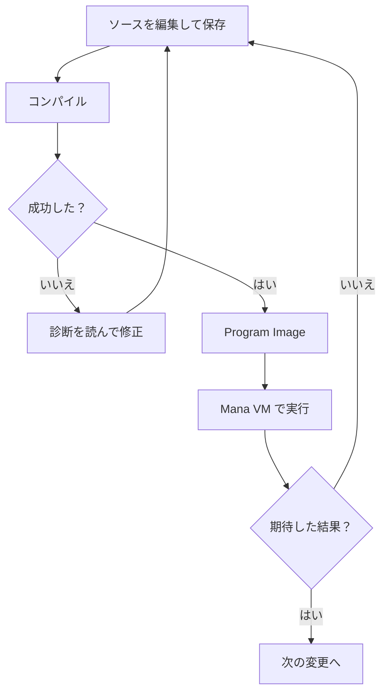

# コンパイルと実行・エラーの直し方

`mana hello.mn` は、ソースをコンパイルし、その結果を Mana VM で実行します。このページでは、二つの工程を分けて確認し、エラーを一つ直してみます。

## コンパイルで何ができるか

コンパイラは、文法や名前、型などを調べ、実行用のデータである **Program Image（プログラムイメージ）** を生成します。Program Image は Mana VM が読むデータであり、CPU が直接実行する実行ファイルではありません。



コンパイルに成功しても、意図した動作になるとは限りません。例えば、表示する順番を間違えたプログラムも、文法が正しければ実行できます。

## わざと一つ間違えて、直す

`hello.mn` を次の内容に置き換えます。この例は**意図的にコンパイルエラーになるコード**です。

```mana
actor Hello
{
    action main
    {
        print("Hello, Mana!\n")
    }
}
```

保存して実行します。

```text
mana hello.mn
```

`print` の行の末尾に `;` がないため、コンパイルに失敗します。現行処理系で確認した診断は次のとおりです。ファイル名の前には保存場所のパスが付く場合があります。

```text
hello.mn(6): error: syntax error
hello.mn(8): error: syntax error
```

最初の行は「hello.mn の6行目で、文法上の問題を見つけた」という意味です。診断の表記はバージョンによって異なりますが、次の情報を探してください。

| 診断に含まれる情報 | 調べること |
| --- | --- |
| ファイル名 | どのファイルを直すか |
| 行番号 | 問題が見つかった場所 |
| メッセージ | 文法の問題か、名前の問題かなど |

コンパイラが間違いに気づくのは、書き忘れた場所の次の行になることもあります。今回なら、閉じ括弧の行を指した場合も、その直前の `print` を確認します。

末尾へ `;` を戻し、保存して再実行してください。最初のエラーを直すと、続いて表示されたエラーも消える場合があります。一度に全部を直そうとせず、最初の診断から調べましょう。

## どの段階で困っているかを分ける

| 症状 | まず行うこと |
| --- | --- |
| `mana` が見つからない | [準備ページ](./getting-started-installation.md)の短縮名設定を確認する |
| `hello.mn` が見つからない | 保存場所、作業場所、拡張子を確認する |
| コンパイルに失敗する | 診断のファイルと行、その直前を確認する |
| 実行中にエラーになる | 実行時のメッセージを読む。コンパイル成功だけでは防げない問題もある |
| エラーはないが結果が違う | 保存したか確認し、処理の途中へ `print` を入れて通った場所を調べる |
| 実行が終わらない | ターミナルで Ctrl+C を押して止め、繰り返しの終了条件などを調べる |

質問するときは、実行したコマンド、コード、診断全文、期待した結果を一緒に示すと状況を伝えやすくなります。

## コンパイル結果を保存する

普段の学習では `mana hello.mn` で十分です。コンパイルと実行を別々に行いたいときは、次を使います。

**コンパイルして保存するコマンド：**

```text
mana hello.mn -o hello.mx
```

`-o` は出力先を指定するオプションです。この場合は `hello.mx` を作り、自動実行はしません。

**保存した結果を実行するコマンド：**

```text
mana --execute hello.mx
```

ソースを変更しても、以前作った `hello.mx` は変わりません。変更を反映するには再度コンパイルします。全オプションは [CLI リファレンス](../reference/reference-cli.md)で調べられます。

次は [Actor と Action](../tutorial/tutorial-actor-and-action.md) で、処理を役割ごとに分けます。
