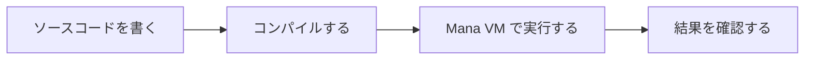

# Mana とは

Mana は、ゲーム内のキャラクターやイベントの進行を、テキストで記述するプログラミング言語です。「案内役が話す → 門を開ける → 次の案内をする」といった、複数の役割を持つ処理を組み合わせるために使います。


## この入門で作るもの

最初に文字を表示し、その後で、案内役と門を連携させる小さなイベントを作ります。学習用のイベントはターミナルへ文字を表示します。ゲーム画面やキャラクター画像を用意する必要はありません。

```text
Guide: Welcome!
Gate: Open.
Event: Finished.
```

実際のゲームでは、文字を表示している部分を、ゲーム本体の会話・アニメーションなどの処理につなぎます。描画、物理、サウンドなどの機能はゲーム側で用意し、Mana でそれらを動かす順番や条件を記述できます。

## 役割、行動、依頼に分ける

この例なら、案内役と門をそれぞれ **Actor（アクター）** にします。Actor は、自分の処理と状態を持つ実行主体です。キャラクターのほか、門やイベント全体の進行役にも使えます。

Actor が行う処理が **Action（アクション）**、Action の実行を依頼する仕組みが **Request（リクエスト）** です。

| 言葉 | このイベントでの例 |
| --- | --- |
| Actor | 案内役の `Guide`、門の `Gate` |
| Action | 会話する `talk`、開く `open` |
| Request | 進行役が、案内役に会話を依頼する |

名前を今すべて覚える必要はありません。コードを書きながら確かめます。

## テキストを書き、コンパイルして実行する

Mana のプログラムは、テキストエディタで書いてファイルに保存します。人が書いたプログラムを **ソースコード**、それを保存したファイルを **ソースファイル** と呼びます。

Mana はコンパイル段階を持つ言語です。**コンパイル**とは、ソースコードを調べ、実行用のデータへ変換することです。そのデータを **Mana VM** という実行環境が動かします。



入門では、一つのコマンドでコンパイルと実行を続けて行います。コンパイラや VM を自分でプログラミングする必要はありません。

## 自分に合う入口を選ぶ

- プログラミングが初めてなら、次の [テキストでプログラムを書く](./getting-started-programming-basics.md) へ進んでください。
- ファイルの編集やターミナルの操作に慣れているなら、[Mana を使う準備](./getting-started-installation.md) から始められます。
- C++ アプリケーションへ組み込みたい場合は、[組み込みガイド](../integration/README.md) を参照してください。
