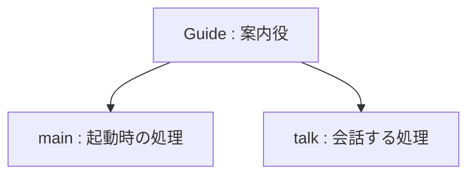

# Actor と Action

このページでは、「行動を定義すること」と「行動を実行すること」を区別します。


## 動かして確かめる

**ファイル全体**です。Mana フォルダーへ `lesson.mn` として保存し、準備ページで設定したターミナルから `mana lesson.mn` を実行してください。前の章のコードへ追加せず、ファイル全体を置き換えます。

```mana
actor Guide
{
    action main
    {
        print("Guide: Ready.\n");
    }

    action talk
    {
        print("Guide: Welcome!\n");
    }
}
```

**期待する出力：**

```text
Guide: Ready.
```

[同梱の完成コード](../../../../examples/tutorial/02-actor.mn)は、Mana フォルダーから次のコマンドでも実行できます。

```text
mana examples/tutorial/02-actor.mn
```


## なぜ Welcome! は出ないのか

`Guide` は一つの Actor で、`main` と `talk` という二つの Action を持ちます。`main` は起動時に VM から実行を依頼されますが、`talk` は定義しただけでは実行されません。



`actor`、`action` は Mana が意味を決めている単語です。`Guide`、`talk` は作者が付けた名前です。`main` には起動時に使われる特別な意味があります。

一つの Actor に複数の Action を定義できます。例えば門なら `open` と `close`、案内役なら `talk` と `warn` のように、目的に応じて分けます。

## Actor はキャラクター以外にも使える

次の章では、イベント全体の進行役も Actor にします。一つのソースファイルに複数の Actor を定義でき、それぞれが自分の処理を持ちます。

複数の Actor に `main` があれば、それぞれが起動時の実行対象です。ファイル全体で一つの `main` だけを選ぶ仕組みではありません。Actor 間の順番を決めたいときは、次の章から学ぶ依頼と待機を使います。

## 一つ変えてみる

`main` の文字を `Guide: Waiting.` に変えて保存・実行してください。`talk` の文字を変えても、この段階では出力に現れません。

次は、その `talk` を実行させます。
## 次に読む

[Action を Request する](./tutorial-request.md)へ進みます。
