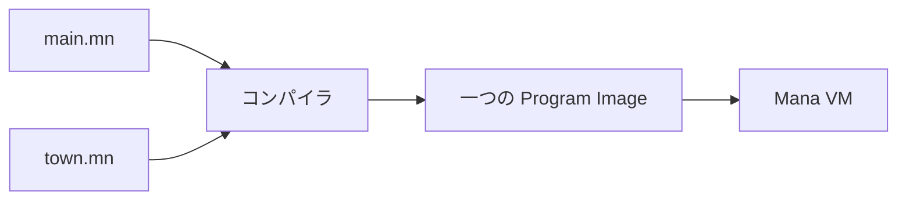

# プログラムを複数のファイルに分ける

[最初に作ったイベント](./tutorial-small-event.md)を、動きを保ったまま二つのファイルへ分けます。新しい機能を足す前に、進行役と町の Actor を別々に編集できるようにします。

## 二つのファイルを作る

Mana フォルダーに `lesson` フォルダーを作り、その中へ次の二つを保存してください。

```text
lesson/
├─ main.mn
└─ town.mn
```

**town.mn のファイル全体：**

```mana
actor Guide
{
    action talk
    {
        print("Guide: Welcome!\n");
    }
}

actor Gate
{
    action open
    {
        print("Gate: Open.\n");
    }
}
```

**main.mn のファイル全体：**

```mana
import "town.mn";

actor Event
{
    action main
    {
        awaitCompletion(10, Guide->talk);
        awaitCompletion(10, Gate->open);
        print("Event: Finished.\n");
    }
}
```

## 入口のファイルを実行する

Mana フォルダーのターミナルで実行します。

```text
mana lesson/main.mn
```

**期待する出力：**

```text
Guide: Welcome!
Gate: Open.
Event: Finished.
```

[同梱の main.mn](../../../../examples/tutorial/11-files/main.mn)と [town.mn](../../../../examples/tutorial/11-files/town.mn)も使えます。

```text
mana examples/tutorial/11-files/main.mn
```

## import はソースを一緒に読み込む

`import "town.mn";` は、別のソースをコンパイル対象へ取り込みます。既定のファイル読み込みでは、相対パスの基準は **import を書いたファイルのあるフォルダー**です。

この例では `main.mn` と同じ場所の `town.mn` を探します。ターミナルから指定する `lesson/main.mn` の基準が作業フォルダーであることと区別してください。



ファイルごとに別々の VM が動くわけではありません。`town.mn` の Actor も、同じプログラムの一部になります。

## 一つ変えてみる

`town.mn` の案内役の文字を変更し、保存してから `mana lesson/main.mn` を再実行してください。入口のファイルを変更しなくても、読み込まれる側の変更が反映されます。

次に `town.mn` を `village.mn` へ名前変更するなら、`main.mn` の `import` も同じ名前へ変更する必要があります。

## import と include

通常のソース分割では `import` から始めてください。同じ解決先のソースを一度だけ取り込み、共通定義の重複読み込みを防ぎます。`include` は指定するたびに読み込みます。

詳しい規則は [ソースファイルリファレンス](../reference/reference-source-files.md)にあります。

## 次に読む

ファイルを分けても、名前は自動でグループ化されません。[namespace で名前を整理する](./tutorial-namespace.md)で、名前の衝突を避ける方法を学びます。
