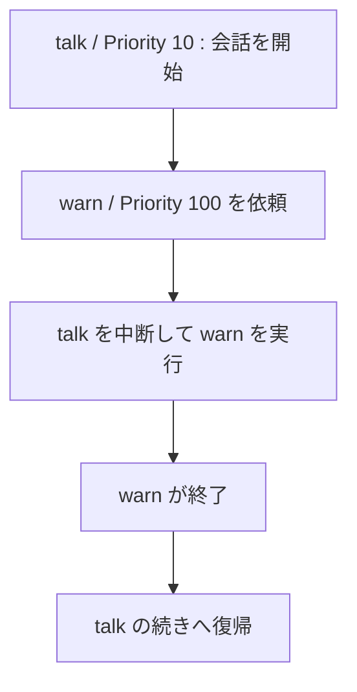

# Priority で割り込みと復帰を扱う

Priority（優先度）は、**同じ Actor の中で、どの Action を優先するか**を表します。数が大きいほど優先されます。今回は、案内役が会話の途中で警告を行い、その後で会話の続きへ戻ります。


## 動かして確かめる

次は**ファイル全体**です。Mana フォルダーの `lesson.mn` を置き換えて保存し、`mana lesson.mn` で実行してください。

```mana
const int kNormalPriority = 10;
const int kEmergencyPriority = 100;

actor Event
{
    action main
    {
        awaitCompletion(kNormalPriority, Guide->talk);
        print("Event: Finished.\n");
    }
}

actor Guide
{
    action talk
    {
        print("Guide: Talk begins.\n");
        request(kEmergencyPriority, self->warn);
        print("Guide: Talk resumes.\n");
    }

    action warn
    {
        print("Guide: Watch out!\n");
    }
}
```

**期待する出力：**

```text
Guide: Talk begins.
Guide: Watch out!
Guide: Talk resumes.
Event: Finished.
```

[同梱の完成コード](../../../../examples/tutorial/09-priority.mn)は `mana examples/tutorial/09-priority.mn` でも実行できます。


## 数字に名前を付ける

`const int kNormalPriority = 10;` は、変更しない整数に名前を付ける **定数**の宣言です。`const` が変更しないことを表します。`k` で始めるのは教材の命名上の約束です。

ここまでは直接10を書いてきました。複数の優先度が登場したので、通常処理の10と緊急処理の100を、名前で区別しています。

## 高い Priority が終わると、元の続きへ戻る

`self` は、その処理を実行している Actor 自身です。`Guide` の `talk` から、同じ `Guide` の `warn` を高い Priority で依頼しています。



ここでは `request` を使います。自分自身を `awaitStart` や `awaitCompletion` で待つと、実行時エラーになります。

この例は同じ Actor 内の割り込みを観察するものです。別 Actor への Request が、OS の割り込みのように任意の瞬間に走ることを意味しません。Actor を進める仕組みは [実行モデル](../concepts/concept-execution-model.md)で説明します。

## 高い、低い、同じを区別する

| 対象 Actor の状態に対する要求 | 基本的な扱い |
| --- | --- |
| 現在より高い、未使用の Priority | 現在の Action より優先する |
| 現在より低い、未使用の Priority | 実行できる状態になるまで保持する |
| 使用中・予約済みと同じ Priority | 新しい要求は受理しない |

受理されるには、対象 Action が存在し、Actor が要求を受け付けていることなども必要です。完全な条件は [Request リファレンス](../reference/reference-request.md)を参照してください。

一つの Actor で使用中の10と、別の Actor で使用中の10は別に管理されます。プログラム全体の実行順を、一つの番号表で決める仕組みではありません。

## 一つ変えてみる

完成コードの `kEmergencyPriority` を100から10へ変えてください。`talk` がすでに10を使用しているため、`warn` は受理されず、警告の出力がなくなります。

```text
Guide: Talk begins.
Guide: Talk resumes.
Event: Finished.
```

試したら100へ戻してください。すべての Action に異なる Priority を付ける必要はありません。順番に完了させるなら同じ値を再利用し、割り込み関係が必要なところに優先度の段階を作ります。

## 次に読む

[待機と同期を使い分ける](./tutorial-wait-and-synchronization.md)で、ここまで使ってきた完了待ちの条件を詳しく確認します。
