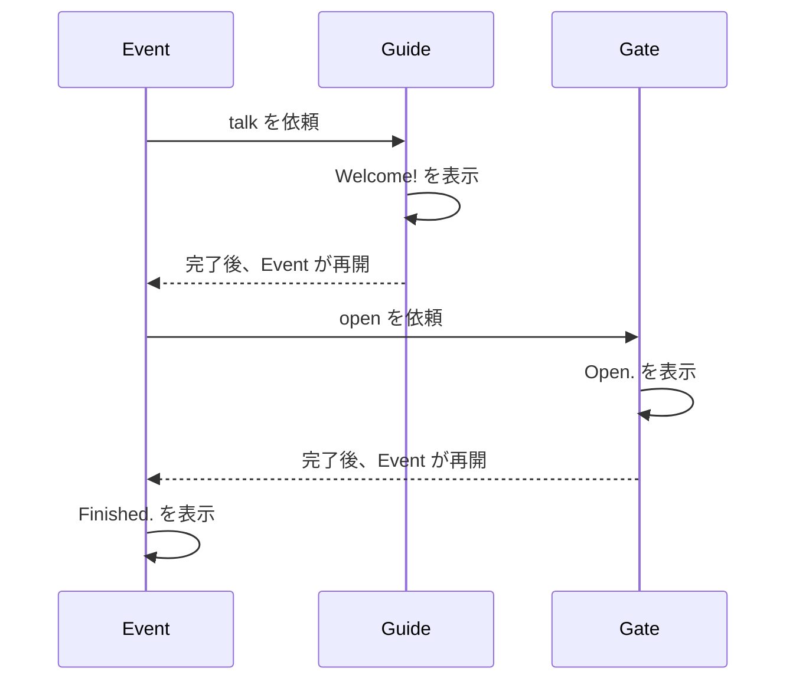

# 会話して門を開ける

ここで最初のイベントを完成させます。案内役が話し、その処理が終わってから門を開け、最後に終了を表示します。

画面上のキャラクターや門はまだ使いません。出力の順番で、イベントの進行を確かめます。

## 動かして確かめる

**ファイル全体**です。Mana フォルダーへ `lesson.mn` として保存し、準備ページで設定したターミナルから `mana lesson.mn` を実行してください。前の章のコードへ追加せず、ファイル全体を置き換えます。

```mana
actor Event
{
    action main
    {
        awaitCompletion(10, Guide->talk);
        awaitCompletion(10, Gate->open);
        print("Event: Finished.\n");
    }
}

actor Guide
{
    action talk
    {
        print("Guide: Welcome!\n");
    }
}

actor Gate
{
    action open
    {
        print("Gate: Open.\n");
    }
}
```

**期待する出力：**

```text
Guide: Welcome!
Gate: Open.
Event: Finished.
```

[同梱の完成コード](../../../../examples/tutorial/04-event.mn)は、Mana フォルダーから次のコマンドでも実行できます。

```text
mana examples/tutorial/04-event.mn
```


## awaitCompletion で順番を作る

`awaitCompletion(10, Guide->talk);` は会話を依頼し、完了を待ってから次へ進むために使います。書き方は `request` と同じく、優先度と Action を指定します。

この例では、他の処理が同じ Actor へ依頼せず、使う Priority も空いているため、順番に処理を完了できます。



待っているのは `Event` です。Mana VM 全体を止めるわけではないので、待たれている `Guide` や `Gate` は処理を進められます。

| やりたいこと | 最初に使う命令 |
| --- | --- |
| 依頼して、相手の終了を待たずに進む | `request` |
| 依頼した処理の終了後に進む | `awaitCompletion` |

`awaitCompletion` は実際には対象 Actor の Priority を条件に待ちます。要求が受理されない場合は待たずに進みます。複数の依頼元や割り込みを導入するときは [待機と同期](./tutorial-wait-and-synchronization.md)の条件も確認してください。

## 一つ変えてみる

`Event` の二つの `awaitCompletion` の行を入れ替えます。保存して実行すると、門が先に開き、続いて案内役が話す順番になります。

元に戻したら、会話の依頼をもう一度、門の後ろに追加してください。出力は「会話 → 門 → 会話 → 終了」になります。前の会話が終わってから再び依頼するので、同じ Priority を再使用できます。

自分自身の Actor を `awaitCompletion` の相手にはできません。Action を分けただけでは別 Actor にはならず、実行時にエラーになります。

## ゲームとの接続は次の段階

`Gate->open` の中身は文字の表示なので、現時点では実際の扉の描画やアニメーションは起きません。ゲームへ接続するときは、その部分を C++ 側の処理につなぎます。まずはこのイベントに、回数や条件を加えていきましょう。
## 次に読む

[変数で状態を覚える](./tutorial-variables.md)へ進みます。
