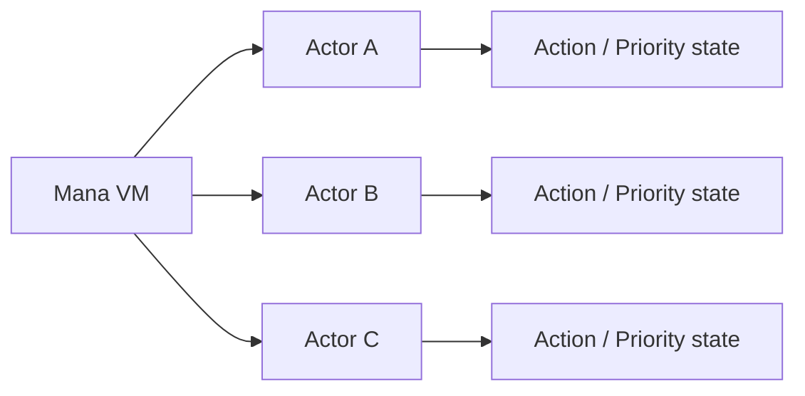
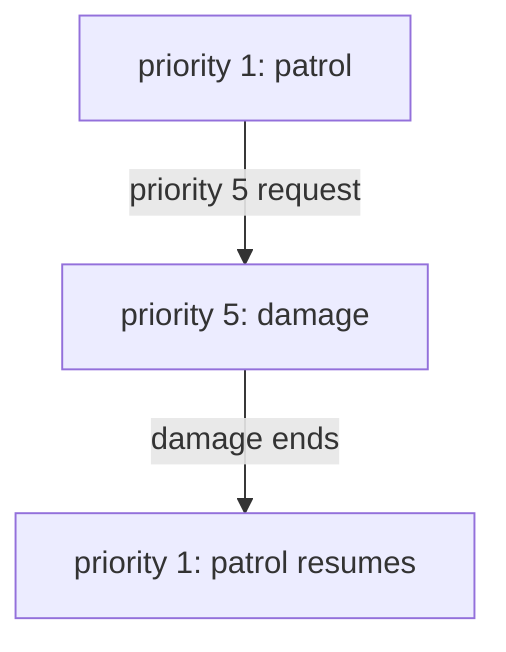

# Mana's execution model

Mana's execution model is based on **several Actors, each with its own independent execution state, advanced cooperatively by the Mana VM**.

It does not create an operating-system thread for each Actor.

From the game's point of view several Actors can be treated as running at the same time, but the VM runs the Actors in turn.

## The overall picture



Each Actor holds its own state: its Actions, Priorities, execution position, stack and so on.

The VM makes several processes cooperate by advancing each Actor.

## The VM advances Actors in turn

The Mana VM's `Run()` runs the registered Actors in turn.

Conceptually, you can think of it like this:

```text
VM Tick
 ├─ Advance Actor A
 ├─ Advance Actor B
 ├─ Advance Actor C
 └─ If needed, advance Actors that were newly Requested
```

This does not mean a CPU thread per Actor.

So Mana's concurrency is **cooperative pseudo-parallel execution**.

The game engine only needs to advance one VM at regular intervals, while on the Mana side the state of several Actors can be described independently.

## An Actor has an execution position

When an Action has run partway and is interrupted by a higher-Priority Action, Mana keeps the original Action's execution position.

```text
priority 1 : patrol
    line A
    line B   ← has run up to here

priority 5 : damage interrupts
```

At the interrupt, the original Action's execution position and stack state are saved.

Then, when `damage` ends, execution returns to the saved state.

```text
priority 5 : damage
    ends
       ↓
priority 1 : patrol
    line C   ← carries on from where it stopped
```

This mechanism is the core of interruption by Priority in Mana.

## Execution state is kept per Priority

An Actor does not hold just one "current Action"; it can keep an execution state for each Priority.

For example, it can hold this state:

```text
priority 5 : damage   ← running now
priority 3 : talk     ← held back
priority 1 : patrol   ← suspended
```

When the higher-Priority Action ends, execution returns to the highest remaining Priority that can run.

This lets you split complex game behaviour into combinations of Actions and Priorities, instead of expressing it only as one giant state machine.

## Ending and resuming Actions

When an Action reaches its end or executes `return`, that Action's Priority is released.

If there is a suspended Action below it, execution returns to its saved position.



If, on the other hand, no Action is left to return to, that Actor has nothing to run.

## `request` adds execution state

`request` is not just a jump instruction.

```mana
request(5, Enemy->damage);
```

This is an operation that adds an execution state for an Action at a new Priority to the target Actor.

If the Priority is higher than the current one it interrupts immediately; if it is lower it is kept to run later. If an execution state already exists at the same Priority, the new Request is not accepted.

This is the big difference from an ordinary Function call.

## The side that waits is also an Actor

With `awaitStart`, `awaitCompletion` and `join`, the calling Actor waits by re-evaluating the same instruction until its condition is met.

In other words, it does not "stop the whole VM and wait".

```text
EventController : waiting for Guard to finish
Guard           : running move
Guide           : can get on with another Action
```

Even while one Actor is waiting, the other Actors can advance.

This property suits event flow and synchronising several characters.

## The role of `yield`

`yield()` hands over execution of the current Action once, at that point.

Use it when you don't want to push a long piece of work through all at once, and want to pass it on to the VM's next step.

```mana
action update
{
    // Some work
    yield();

    // Continue on the next step
}
```

The detailed scheduling rules are covered in the Language Reference; in Concepts, think of it as "the mechanism by which an Actor gives up its turn by itself".

## `rollback` winds Priority back

Normally, when the current Action ends, execution returns to the previous Action one level at a time.

With `rollback`, you can discard all execution states above a given Priority at once and return to the state at a lower Priority.

You can use this for control such as:

- Cancelling a behaviour
- Ending a chain of interrupts all at once
- Forcing a return to the basic behaviour

The exact boundary conditions and syntax are covered in the Language Reference.

## `refuse` and `lock`

`refuse()` controls whether an Actor accepts new Requests. `comply()` resumes accepting them.

`lock` is somewhat different. The current compiler generates instructions that switch the synchronised execution state before and after a `lock` block, and the VM turns the `Synchronized` flag of the current Priority on and off.

However, **the current `Actor::Request` does not directly use this flag when deciding whether to accept a Request or whether a Priority interrupts.**

So don't think of the current `lock` as a mutex or as "an atomic section that can never be interrupted". The exact current behaviour is covered in the [execution control reference](../reference/reference-execution-control.md).

## `init` and `main` at startup

When a program is loaded, the VM creates the ordinary Actors, does the initialisation work, and then Requests each Actor's `init` and `main`.

Conceptually, the flow is:

```text
Load the Program Image
    ↓
Create the Actors
    ↓
Global initialisation
    ↓
Queue each Actor's main at Priority 0
    ↓
Request each Actor's init at the highest Priority (2147483647)
    ↓
Normal VM execution
```

This lets an Actor describe its startup initialisation and its normal behaviour as Actions. However, there is no collective wait in which all Actors' `init` finish before any Actor's `main` starts. Each Actor runs its queued Actions in Priority order after its own `init` finishes. Where cooperation needs initialisation to have happened, design the order explicitly.

## Mana's execution model in a nutshell

What makes Mana distinctive is not simply that "there are several Actors".

What matters is that the VM cooperatively advances this structure:

```text
Actor
  ├─ Holds its own state
  ├─ Has Actions
  ├─ Receives Requests
  ├─ Holds execution state per Priority
  └─ Interrupts, waits and resumes
```

With this model, game processing such as "walk", "talk", "attack", "take damage" and "wait for an event" can be combined as independent Actions.

## What to remember so far

- The Mana VM advances several Actors in turn
- Each Actor has its own independent execution state
- Mana's concurrency is not parallel execution with operating-system threads
- Action state can be kept per Priority
- A higher-Priority Action can interrupt a lower-Priority Action
- A new Request at a Priority is not accepted if that Priority already exists
- After an Action ends, the suspended Action can resume
- Waiting with the await instructions does not stop the whole VM
- `refuse` controls whether new Requests are accepted
- In the current implementation, `lock` switches a synchronisation flag, but does not directly prevent Requests from interrupting

## Read next

This completes the overall picture of Mana's core: Actor / Action / Request / Priority and the VM's execution model.

Next come the concepts that support larger script structures: Module, Phantom and Namespace.
