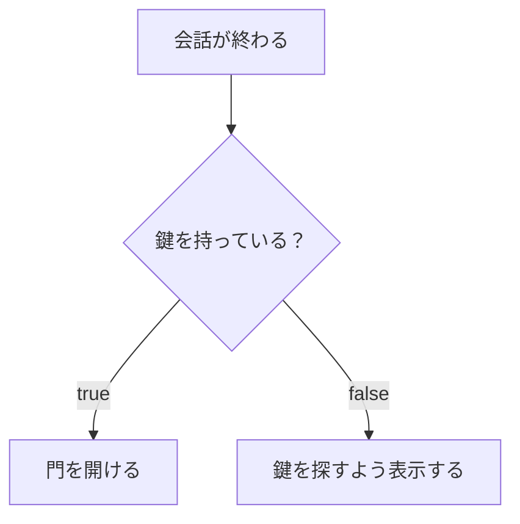

# 条件によって処理を変える

最初のイベントに「鍵があるときだけ門を開く」という条件を加えます。

## 動かして確かめる

**ファイル全体**です。Mana フォルダーへ `lesson.mn` として保存し、準備ページで設定したターミナルから `mana lesson.mn` を実行してください。前の章のコードへ追加せず、ファイル全体を置き換えます。

```mana
actor Event
{
    action main
    {
        bool hasKey = true;

        awaitCompletion(10, Guide->talk);
        if (hasKey)
        {
            awaitCompletion(10, Gate->open);
        }
        else
        {
            print("Event: Find the key.\n");
        }
    }
}

actor Guide
{
    action talk
    {
        print("Guide: Welcome!\n");
    }
}

actor Gate
{
    action open
    {
        print("Gate: Open.\n");
    }
}
```

**期待する出力：**

```text
Guide: Welcome!
Gate: Open.
```

[同梱の完成コード](../../../../examples/tutorial/06-conditions.mn)は、Mana フォルダーから次のコマンドでも実行できます。

```text
mana examples/tutorial/06-conditions.mn
```


## if と else

`bool hasKey = true;` は、鍵を持っている状態を表します。`true` は成立、`false` は不成立を表す値です。

`if (hasKey)` は、その値が成立しているときだけ最初のブロックを実行します。不成立なら `else` のブロックを実行します。両方を実行するわけではありません。



## 一つ変えてみる

`hasKey` の初期値を `false` に変更して保存・実行してください。

```text
Guide: Welcome!
Event: Find the key.
```

今回の鍵の状態は、自分でコードに設定しています。プレイヤーの操作や持ち物を自動で読み取っているわけではありません。

## 数を比べる

前の章の会話回数なら、`mTalkCount == 0` と書くことで、0かどうかを調べられます。

| 書き方 | 意味 |
| --- | --- |
| `a == b` | 等しい |
| `a != b` | 等しくない |
| `a < b` / `a <= b` | 小さい / 以下 |
| `a > b` / `a >= b` | 大きい / 以上 |

`=` は代入、`==` は比較です。`hasKey = true` と書くと値を変更してしまいます。条件を調べる用途とは区別してください。

## 条件を組み合わせる

**Action 内の例：**

```mana
bool hasKey = true;
bool isOpen = false;
if (hasKey && !isOpen)
{
    print("Ready to open.\n");
}
```

`&&` は両方が成立、`||` は少なくとも一方が成立、`!` は成立・不成立を逆にします。上の条件は「鍵があり、まだ開いていない」です。

## 会話を変える練習

[前の章](./tutorial-variables.md)の完成コードに戻り、`talk` の中身を次に置き換えてください。

```mana
if (mTalkCount == 0)
{
    print("Guide: Welcome!\n");
}
else
{
    print("Guide: Welcome back!\n");
}
mTalkCount = mTalkCount + 1;
```

最初は `Welcome!`、2回目は `Welcome back!` になります。比較してから回数を増やしている点に注目してください。
## 次に読む

[処理を繰り返す](./tutorial-loops.md)へ進みます。
