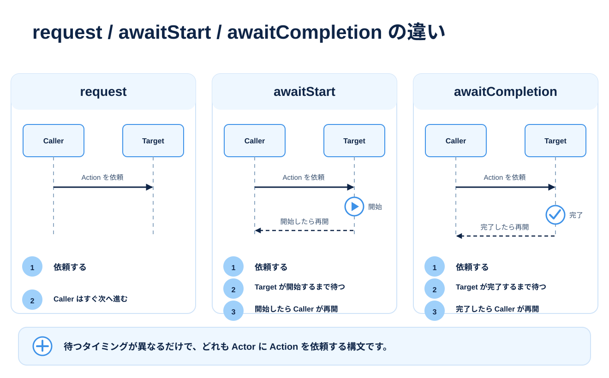

# 待機と同期を使い分ける

[会話して門を開ける](./tutorial-small-event.md)では、`awaitCompletion` で順番を作りました。ここでは、開始可能になるのを待つ、すでに動いている Actor を待つ、自分の処理を一度譲る、という使い方を追加します。



## まずは完了待ちを振り返る

**イベントの main 内の抜粋：**

```mana
awaitCompletion(10, Guide->talk);
awaitCompletion(10, Gate->open);
```

この例は、要求が受理され、他の要求元による競合がない前提で、会話を終えてから門を開きます。

`awaitCompletion` が直接調べるのは、**対象 Actor の現在の Priority が指定値より低くなったか**です。要求一件ごとの完了通知を記録して待っているわけではありません。

## 三つの待機を区別する

以下の条件は、await 系では要求が受理された場合のものです。

| 命令 | 新しく要求するか | 呼び出し側が先へ進める条件 |
| --- | --- | --- |
| `request(p, Actor->action)` | する | 待機しない |
| `awaitStart(p, Actor->action)` | する | 対象 Actor の現在の Priority が `p` 以下 |
| `awaitCompletion(p, Actor->action)` | する | 対象 Actor の現在の Priority が `p` 未満 |
| `join(p, Actor)` | しない | 対象 Actor の現在の Priority が `p` 以下 |

`p` は説明のための仮の名前です。実際には10などの整数や定数を指定します。

`awaitStart` は、要求した Action が開始できる Priority まで進むのを待つ用途に使います。**その Action の最初の文が実行済みであることまでは保証しません。** 相手の処理結果が必要なら、開始可能になることと、その処理が終わることを区別してください。

`join(0, Guide);` は新しい会話を始めません。`Guide` の現在の Priority が0以下になるまで待ちます。`main` の Priority は0なので、これは Actor の全処理の終了を意味する条件でもありません。

## 要求が受理されない場合

`awaitStart` と `awaitCompletion` は、最初の要求が受理されなければ待たずに次へ進みます。空くまで要求を繰り返す命令ではありません。

例えば、対象 Actor の Priority 10 がすでに使用中なら、別の Action を10で依頼しても、その Action の実行は保証されません。待機から戻ったことだけを、その行動が成功した証拠として扱わないでください。

入門のイベントでは、一つの進行役が一つずつ要求し、終了を待ってから次を依頼することで、この競合を避けています。複数の Actor から同じ相手へ要求する設計では、依頼元と Priority の分担も決めます。

また、自分自身を対象とする `awaitStart` / `awaitCompletion` は、実行時エラーになります。

## yield で実行を譲り、delay で秒数を待つ

## 動かして確かめる

次は**ファイル全体**です。Mana フォルダーの `lesson.mn` を置き換えて保存し、`mana lesson.mn` で実行してください。

```mana
native void delay(float seconds);

actor Guide
{
    action main
    {
        print("Guide: Step 1.\n");
        yield();
        print("Guide: Step 2.\n");
        delay(0.5);
        print("Guide: Step 3.\n");
    }
}
```

**期待する出力：**

```text
Guide: Step 1.
Guide: Step 2.
Guide: Step 3.
```

[同梱の完成コード](../../../../examples/tutorial/10-yield.mn)は `mana examples/tutorial/10-yield.mn` でも実行できます。


`yield()` は現在の Action を終了せず、実行をいったん VM に返します。再び実行機会が来ると、その続きから進みます。

出力だけでは間隔は見えません。`yield()` は「1秒待つ」という命令ではなく、「1ゲームフレーム待つ」とも限りません。VM をいつ進めるかは、ホストアプリケーション側の呼び出し方によります。

長い繰り返しでは、`yield()` を使って他の Actor に実行機会を渡せます。実時間やアニメーションの終了待ちは、ゲーム側の更新・完了条件と組み合わせて設計します。

`delay(0.5)` は、VM の時間で0.5秒待ってから続きを実行します。C++ 側の組み込み関数 `Delay` は、Mana には小文字の `delay` という名前で登録されています。使用するファイルには `native void delay(float seconds);` と宣言します。

CLI と引数なしの `VM::Run()` は単調時計で計測した経過時間を使います。組み込み先では `VM::Run(deltaSeconds)` に経過秒数を渡すことで、ポーズや倍速を制御できます。`Run(0.0)` では時間は進みませんが、実行可能な命令は処理します。再開は期限以降の最初の実行機会になるため、更新間隔による遅れは生じます。割り込み中も VM の時間は進み、待機期限は維持されます。

`delay(0.0)` は待機せず続行します。負数や非有限値は実行時エラーです。以前の整数のフレーム数を受け取る `delay` とは互換性がありません。

## 選び方を確かめる

次の用途に合うものを考えてください。

- 会話の終了後に門を開く：`awaitCompletion`
- 通知を依頼し、進行役はその完了を待たずに進む：`request`
- 新しい行動を依頼せず、対象の Priority が指定値以下になるのを待つ：`join`
- 自分の処理を終了せず、一度実行を譲る：`yield`
- VM の時間で指定秒数だけ待つ：`delay`

境界条件や関連する制御は [Request](../reference/reference-request.md)と [実行制御](../reference/reference-execution-control.md)で調べられます。

## 次に読む

[複数のファイルに分ける](./tutorial-multiple-files.md)で、完成したイベントを整理します。
